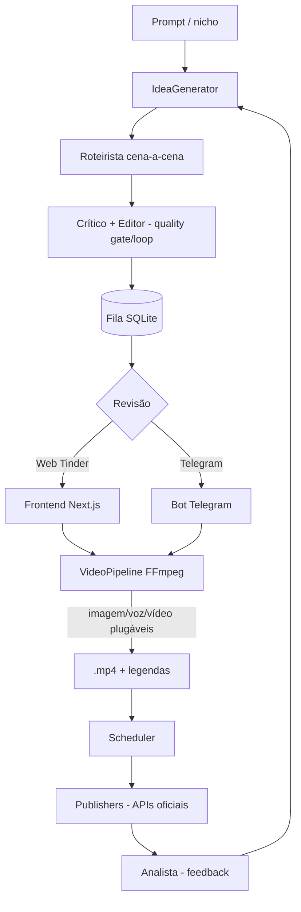

# Auto Niche Engine

Pipeline multi-agente, **100% local**, para produção de conteúdo de nicho com IA.
Gera ideias e roteiros com [Ollama](https://ollama.com/) na sua máquina, filtra
por qualidade, deixa você revisar estilo **Tinder** (web ou Telegram), renderiza
vídeos curtos (imagem/voz/vídeo plugáveis + legendas), agenda e publica pelas
**APIs oficiais** das plataformas — tudo empacotado em Docker.

> **Escopo.** Apenas o núcleo legítimo de geração/curadoria/publicação. **Nada**
> de automação de publicação em massa ou evasão de detecção (fingerprint
> spoofing, proxies por conta, etc.) — isso viola os Termos das plataformas. A
> publicação é sempre via APIs oficiais, dentro das regras de cada rede.

## Arquitetura



**Padrão central:** cada capacidade externa é um *contrato + factory selecionável
por config/env*, o que torna a troca de modelo/provedor uniforme:

| Capacidade | Factory | Providers |
|---|---|---|
| Texto (LLM) | `agents.llm.get_text_client` | `ollama` · `gemini` |
| Imagem | `agents.media.get_image_generator` | `placeholder` · `stability` · `gemini` |
| Voz | `agents.media.get_voice_generator` | `placeholder` · `elevenlabs` |
| Vídeo (por cena) | `agents.media.get_video_generator` | `none` · `gemini` (Veo) |
| Publicação | `publishers.get_publisher` | `none` · `youtube` · `instagram` · `tiktok` |

## Estrutura de arquivos

```
neocoisas/
├── server.py                 # API FastAPI (ideias, board, agenda, modelos, métricas)
├── engine.py                 # Orquestração: prompt → ideias → (revisão | postagem)
├── render.py                 # Renderização de uma Idea → vídeo (+ thumbnail, i18n)
├── scheduler.py              # Agendamento (postagem + autogeração de ideias)
├── registry.py               # Registry unificado de modelos/provedores
├── settings.py               # Seleção de modelos em runtime (persistida)
├── jobs.py                   # Jobs em background (geração assíncrona)
├── telegram_bot.py           # Bot do Telegram (serviço opt-in)
├── main.py                   # Entrada CLI (estratégia + roteiro)
├── agents/
│   ├── llm/                  # Factory de LLM de texto (ollama/gemini)
│   ├── media/                # Factories de imagem/voz/vídeo (+ placeholders)
│   ├── niche_creator.py · script_writer.py · idea_generator.py
│   ├── critic.py · editor.py · titler.py · translator.py · analyst.py
│   └── video_pipeline.py     # Montagem FFmpeg (imagem/vídeo + narração + legenda)
├── review/                   # Idea + ReviewQueue (SQLite)
├── board/                    # Kanban: Card + BoardStore (SQLite) + seed
├── publishers/               # YouTube / Instagram / TikTok (APIs oficiais)
├── web/                      # Frontend Next.js (5 abas)
├── dashboard/app.py          # Painel Streamlit (legado)
├── docs/entregas/            # Um MD por entrega (estilo PR)
├── tests/                    # ~141 testes offline
├── Dockerfile.api · web/Dockerfile · Dockerfile.bot · docker-compose.yml
└── config.example.json · .env.example · CLAUDE.md
```

## Rodar com Docker (recomendado)

Sobe a stack inteira — **Ollama + API (FastAPI) + frontend (Next.js)** — com um
comando. O Ollama roda no próprio Docker e baixa o modelo no primeiro start.

```bash
docker compose up -d --build
```

- Interface: http://localhost:3000
- API: http://localhost:8000/api/health
- Modelo: defina `OLLAMA_MODEL` (padrão `llama3`), ex.:
  `OLLAMA_MODEL=llama3 docker compose up -d --build`
- **GPU NVIDIA:** descomente o bloco `deploy` do serviço `ollama` no
  `docker-compose.yml` (requer o NVIDIA Container Toolkit).

Serviços: `ollama` (LLM local), `ollama-pull` (baixa o modelo uma vez), `api`
(aponta para `http://ollama:11434` via `ANE_OLLAMA_BASE_URL`) e `web`. O estado
(fila de ideias e Kanban) persiste no volume `ane_output`.

## Interface web (Next.js) + API (FastAPI)

Interface **Next.js** (`web/`) servida pela API em `server.py`, com 5 abas:

- **💡 Ideias** — prompt + modo **Manual (Tinder)** (aprovar/rejeitar ❌/♥ ou
  setas ← →) ou **Auto (prompta-e-posta)**; renderizar e postar as aprovadas.
- **🗂️ Kanban** — roadmap em sprints (arrastar-e-soltar, adicionar/remover).
- **⏱️ Agendamento** — postagem automática por intervalo + autogeração de ideias.
- **⚙️ Modelos** — troca de provider/modelo por capacidade e **override por
  agente**, sem editar arquivo (consome `/api/models`).
- **📊 Dashboard** — KPIs da esteira, desempenho por vídeo e insights do analista.

Sem Docker, em desenvolvimento (dois terminais):

```bash
# 1) API (mesma máquina do Ollama)
pip install -r requirements.txt
uvicorn server:app --reload --port 8000

# 2) Frontend
cd web && npm install && npm run dev
```

## Como executar localmente (CLI / Streamlit)

1. **Suba o Ollama** na sua máquina, usando a GPU:

   ```bash
   ollama run llama3
   ```

2. **Configure** o projeto copiando o modelo e ajustando os valores:

   ```bash
   cp config.example.json config.json
   ```

3. **Instale as dependências**:

   ```bash
   pip install -r requirements.txt
   ```

4. **Rode pela linha de comando**:

   ```bash
   python main.py                       # usa o nicho de config.json
   python main.py "Gatos Astronautas"   # sobrescreve o nicho pontualmente
   python main.py "Gatos" --script      # plano + roteiro do 1º tópico em alta
   ```

   **ou abra o painel**:

   ```bash
   streamlit run dashboard/app.py
   ```

## Configuração (`config.json`)

| Chave               | Descrição                                             |
| ------------------- | ----------------------------------------------------- |
| `creator_name`      | Nome exibido no painel.                               |
| `active_niche`      | Nicho alvo padrão (ex: `"League of Legends Memes"`).  |
| `ollama_model`      | Modelo do Ollama a usar (ex: `"llama3"`).             |
| `ollama_base_url`   | URL do servidor Ollama (padrão `http://localhost:11434`). |
| `request_timeout`   | Timeout (segundos) das chamadas ao Ollama.            |
| `platforms_target`  | Plataformas alvo (usado como metadado).               |

Há mais chaves (provedores, crítico/editor, agendamento, `agent_models`, etc.) —
veja **`config.example.json`** para a lista completa, e **`.env.example`** para as
variáveis de ambiente/segredos. `config.json` e `.env` estão no `.gitignore`.

## Pipeline de vídeo

`agents/video_pipeline.py` define a sequência de montagem (imagem + narração →
clipe → concatenação) usando FFmpeg. Os geradores de **imagem** e de **voz**
são pontos de extensão (`hooks`) que você conecta às ferramentas de sua
escolha:

```python
from agents.video_pipeline import VideoPipeline, VideoJob, Scene

pipeline = VideoPipeline(
    image_generator=minha_funcao_de_imagem,  # (prompt, dest) -> Path
    voice_generator=minha_funcao_de_voz,      # (texto, dest) -> Path
)
job = VideoJob(title="meu_video", scenes=[Scene("Narração...", "Prompt visual...")])
pipeline.render(job)
```

Requer o **FFmpeg** instalado e disponível no `PATH`.

## Agente roteirista (cena-a-cena)

`agents/script_writer.py` transforma um tópico em alta num roteiro concreto:
uma lista de `Scene` (narração + prompt visual + duração) pronta para virar um
`VideoJob`. Ele conversa com o mesmo Ollama local; a conversão da resposta em
cenas (`build_scenes`) é pura e coberta por testes.

```python
from agents.script_writer import ScriptWriterAgent

agent = ScriptWriterAgent()
job = agent.build_video_job("Gatos Astronautas", num_scenes=5)  # -> VideoJob
# job.scenes já pode ser passado ao VideoPipeline.render(job)
```

## Geração de mídia e publicação (pré-configurado)

Os geradores de imagem/voz e o publisher são **plugáveis** e escolhidos por
config (`config.json`) ou variável de ambiente:

| Config | Opções | Padrão |
|---|---|---|
| `image_provider` / `ANE_IMAGE_PROVIDER` | `placeholder`, `stability`, `gemini` | `placeholder` |
| `voice_provider` / `ANE_VOICE_PROVIDER` | `placeholder`, `elevenlabs` | `placeholder` |
| `video_provider` / `ANE_VIDEO_PROVIDER` | `none`, `gemini` | `none` |
| `publisher` / `ANE_PUBLISHER` | `none`, `youtube` | `none` |

- **placeholder** usa só o FFmpeg (fundo colorido + áudio) — o vídeo renderiza
  **out of the box**, sem chave nenhuma.
- **stability / elevenlabs** exigem `STABILITY_API_KEY` / `ELEVENLABS_API_KEY`.
- **gemini** usa a `GEMINI_API_KEY`: como `image_provider` gera imagens (Imagen);
  como `video_provider` gera um **clipe por cena** (Veo) e muxa narração/legenda,
  em vez do slide estático. Modelos ajustáveis via `GEMINI_IMAGE_MODEL` /
  `GEMINI_VIDEO_MODEL` (ver `.env.example`).
- **youtube** faz o upload real via YouTube Data API v3
  (`google-api-python-client`). Configure as credenciais OAuth **no `.env`**
  (nunca no código): `YOUTUBE_CLIENT_ID`, `YOUTUBE_CLIENT_SECRET`,
  `YOUTUBE_REFRESH_TOKEN` (+ opcionais `YOUTUBE_PRIVACY`, `YOUTUBE_CATEGORY_ID`)
  e `ANE_PUBLISHER=youtube`. Depois `docker compose up -d`. O `.env` está no
  `.gitignore` — os segredos não vão para o git.

Renderizar uma ideia aprovada: botão **Renderizar vídeo** no frontend, ou
`POST /api/ideas/{id}/render` (o vídeo fica em `POST` → preview via
`GET /api/ideas/{id}/video`). Nada de automação de evasão — publicação só via
APIs oficiais.

## Automações

- **Agente crítico (quality gate)** — `agents/critic.py`: dá nota 0–10 à ideia; com
  `critic_enabled` no config, ideias abaixo de `critic_min_score` são
  auto-rejeitadas antes da revisão.
- **Geração automática de ideias** — o scheduler cria ideias sozinho por intervalo
  a partir de um prompt fixo (`autogen_*`), mantendo a esteira cheia (aba
  Agendamento / `POST /api/schedule/autogen-now`).
- **Agendamento de postagens** — publica as aprovadas por intervalo (modo simulado
  sem token).
- **Notificações no Telegram** — o bot avisa quando surgem ideias pendentes
  (`TELEGRAM_NOTIFY_CHAT_ID`).
- **Publishers** — YouTube (upload real), Instagram/TikTok (scaffold, requerem
  credenciais).

## Troca de modelos

Todo provedor/modelo é trocável por config, variável de ambiente **ou pela aba
⚙️ Modelos** (persistida em runtime). Endpoints:

- `GET /api/models` — capacidades, providers, modelos, seleção atual e o que
  falta configurar (chaves).
- `GET /api/models/available` — modelos realmente instalados no Ollama
  (`/api/tags`) + conhecidos dos provedores.
- `PUT /api/models/select` — troca provider/modelo de uma capacidade.
- `PUT /api/models/agent` — **modelo por agente** (ex.: crítico mais forte,
  ideias mais rápido).

## Bot do Telegram (opcional)

`telegram_bot.py` opera toda a arquitetura pelo Telegram, falando com a API por
HTTP. Comandos: `/gerar <prompt>` e `/auto <prompt>`, `/pendentes`, `/aprovadas`;
aprovar/rejeitar e renderizar/postar por **botões inline**.

Suba como serviço opt-in (com `TELEGRAM_BOT_TOKEN` no `.env`):

```bash
docker compose --profile bot up -d --build
```

Opcional: `TELEGRAM_ALLOWED_CHAT_IDS` (CSV) restringe quem pode usar o bot.

## Testes

~141 testes **offline** (sem Ollama/rede): parsing, fila e board (SQLite),
engine, pipeline/legendas, agendamento, factories de modelo, registry, settings,
integração HTTP da API. CI roda `pytest` + `next build` a cada push (`.github/workflows/ci.yml`).

```bash
pip install -r requirements-dev.txt
pytest
```

## Convenções

Ver **`CLAUDE.md`**: cada entrega acompanha um MD estilo PR em `docs/entregas/`,
testes antes do commit, Kanban como fonte de verdade do roadmap, segredos só no
`.env`, e o padrão de *factory por capacidade*.

## Licença

[MIT](LICENSE). Sinta-se livre para ajustar ao seu caso.
