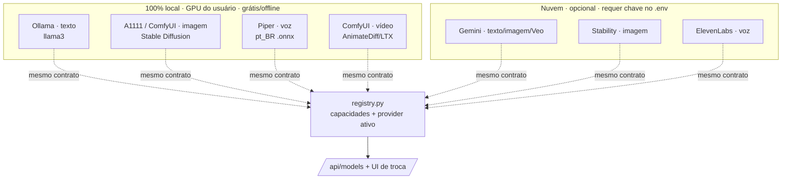

# Arquitetura de IA — modelos locais (estado atual + o que a feature exige)

> **Status:** planejamento/arquitetura · complementa
> [`arquitetura-planejamento-anual.md`](./arquitetura-planejamento-anual.md).
> Foco: **como a IA roda com modelos locais** hoje, e o que o time de marketing
> (Brand Kit, fotos da estética, trends) acrescenta — sempre **local-first**.
> Apresentação visual: **[IA Local-First](https://claude.ai/code/artifact/48336c86-bace-46f2-bb1a-34c15956ba8b)**.

## 1. Princípio: local-first por `contrato + factory`

Toda capacidade de IA é um **contrato** com uma **factory selecionável por config/env**
(padrão do repo, ver `CLAUDE.md`). O **padrão é local e grátis** (roda na GPU da máquina,
sem chave, offline); provedores de nuvem são **trocas opcionais** por qualidade, sem mexer
nos agentes. Fonte de verdade: `registry.py` (`GET /api/models`).

## 2. O mapa atual (capacidade → factory → providers)

| Capacidade | Factory | Providers **locais** | Providers nuvem (opcional) | Padrão |
|---|---|---|---|---|
| **Texto (LLM)** | `agents/llm/factory.py` · `get_text_client` | **ollama** (GPU, `llama3`) | gemini | `ollama` |
| **Imagem** | `agents/media/factory.py` · `get_image_generator` | **a1111** (Stable Diffusion), **comfyui** (workflow) | stability, gemini (Imagen) | `placeholder`¹ |
| **Voz/TTS** | `get_voice_generator` | **piper** (offline, PT-BR `.onnx`) | elevenlabs | `placeholder`¹ |
| **Vídeo** | `get_video_generator` | **comfyui** (AnimateDiff/LTX) | gemini (Veo) | `none`² |
| **Publicação** | `publishers/factory.py` · `get_publisher` | — | youtube, instagram, tiktok (APIs oficiais) | `none` |

¹ `placeholder` gera mídia sintética (FFmpeg) para o pipeline rodar **sem configuração**;
trocar para `a1111`/`comfyui`/`piper` liga a mídia local real.
² `none` = imagem estática com movimento Ken Burns (sem gerar vídeo por cena).



## 3. Rodar 100% local (a stack offline)

Trocando 3 chaves no `config.json`/env, tudo roda na máquina, sem nuvem:

```json
{ "text_provider": "ollama", "image_provider": "a1111",
  "voice_provider": "piper", "video_provider": "none" }
```

- **Texto:** Ollama (`ollama_base_url`, `ollama_model`); modelos instalados são descobertos
  ao vivo via `/api/tags`.
- **Imagem:** A1111 (`A1111_URL`, 9:16, negative prompt) ou ComfyUI (`COMFYUI_URL` +
  workflow em *API format* com marcador `%prompt%`).
- **Voz:** Piper (`PIPER_MODEL`, incluso na imagem Docker).
- **Vídeo:** ComfyUI (`COMFYUI_VIDEO_WORKFLOW`) quando quiser vídeo por cena.

Compose: `docker compose --profile sd up` sobe o A1111; ComfyUI/Ollama seguem o mesmo padrão.

## 4. Como o time de marketing usa a IA local (texto)

Os 8 agentes de texto passam **todos** pelo `get_text_client` e aceitam **modelo por agente**
(`agent_models` / `ANE_AGENT_MODEL_<AGENTE>`) sobre o padrão global — o crítico pode usar um
modelo mais forte que o redator, por exemplo.

`idea` · `script` · `critic` · `editor` · `titler` · `translator` · `analyst` · `niche`
→ Copy, Roteirista, Guardião da Marca, Editor-chefe, Títulos A/B, Localização, Analista,
Estratégia (ver [agência virtual](./arquitetura-planejamento-anual.md#12-bis)).

## 5. O que a feature acrescenta à arquitetura de IA (local-first)

O Brand Kit (fotos da estética) e o padrão-por-post pedem **duas capacidades novas** — ambas
com caminho **local**:

### 5.1. Nova capacidade: **visão** (ler as fotos da estética)
Para transformar as **fotos de referência** em descritores de estilo (e gerar *alt text*),
falta uma capacidade **multimodal**. Proposta: nova factory `agents/vision/factory.py`
`get_vision_client`, no mesmo padrão, com provider **local padrão**:

| Provider | Modelo local | Uso |
|---|---|---|
| **ollama** (local) | `llama3.2-vision`, `llava`, `moondream`, `qwen2-vl` | descreve a estética da marca → `style_keywords`; alt text |
| gemini (nuvem) | `gemini-*-vision` | alternativa por qualidade |

Saída alimenta o `BrandKit.style_keywords` e a acessibilidade dos posts.

### 5.2. **Referência de estilo** na imagem (o "padrão" visual)
Para todo post sair com a mesma cara a partir das fotos, o provider de imagem precisa aceitar
**imagem de referência**, não só texto. Caminho **local**:

- **ComfyUI + IP-Adapter / img2img** — workflow de *style reference* (as `reference_images`
  entram como condicionamento). Reusa o provider `comfyui` com um **novo template de workflow**.
- **A1111 img2img + ControlNet/IP-Adapter** — alternativa no provider `a1111`.

Dois níveis (plugáveis pelo mesmo factory):
1. **Leve (MVP):** visão (5.1) descreve a estética → injeta `style_keywords` no prompt
   (funciona em **qualquer** provider de imagem).
2. **Forte:** referência visual real via IP-Adapter (ComfyUI/A1111) — fidelidade estética alta,
   exige GPU.

### 5.3. (Opcional) **Embeddings locais**
Para checagem de consistência/dedup semântica de ideias e casamento de trends, uma capacidade
`embeddings` local (Ollama `nomic-embed-text`) pode entrar depois — mesmo padrão factory.

## 6. Modelos locais recomendados (ordem de grandeza)

| Capacidade | Modelo local sugerido | GPU/VRAM aprox. |
|---|---|---|
| Texto | Ollama `llama3.1`/`qwen2.5` 7–8B | 8 GB+ |
| Visão | Ollama `llama3.2-vision` 11B / `moondream` (leve) | 6–12 GB |
| Imagem | SDXL via A1111/ComfyUI (+ IP-Adapter) | 8–12 GB |
| Voz | Piper (CPU) | — (roda em CPU) |
| Vídeo | ComfyUI AnimateDiff/LTX | 12 GB+ |

Tudo degrada com elegância: sem GPU, `placeholder`/`none` mantêm o pipeline rodando; a nuvem
é *fallback* opcional por capacidade.

## 7. Cards (arquitetura de IA)

1. **Capacidade `vision` (factory + provider Ollama multimodal)** — descreve fotos da estética
   → `style_keywords` + alt text. `alta`, backend, conteúdo.
2. **Registry: capacidade `vision`** em `registry.py`/`GET /api/models` + UI de troca. `média`, backend.
3. **Workflow ComfyUI de referência de estilo (IP-Adapter)** para o Brand Kit. `alta`, backend, conteúdo.
4. **Injeção automática de `style_keywords`+paleta no `visual_prompt`** (nível leve). `alta`, backend.
5. *(opcional)* **Capacidade `embeddings` local** (dedup/consistência). `baixa`, backend.

## 8. Conformidade e privacidade

- **Dados na máquina:** rodando local (Ollama/A1111/ComfyUI/Piper), briefing, fotos da estética
  e roteiros **não saem** do ambiente do usuário. Bom para marca/segredos.
- **Nuvem é opt-in:** só ativa com chave no `.env` (`GEMINI_API_KEY`, etc.), nunca no git/chat.
- **Publicação sempre por API oficial** (regra do `CLAUDE.md`).

## 9. Referências (código)

- `agents/llm/factory.py`, `agents/media/factory.py`, `publishers/factory.py`
- `registry.py` (capacidades, `REQUIRES`, `KNOWN_MODELS`, `current`)
- `agents/media/comfyui.py`, `agents/media/providers.py` (a1111, piper)
- Entregas: `docs/entregas/midia-local-gratis.md`, `provider-comfyui.md`, `voz-local-piper.md`,
  `registry-unificado-modelos.md`, `descoberta-de-modelos.md`
</content>
