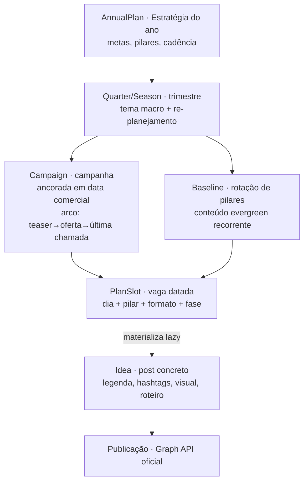
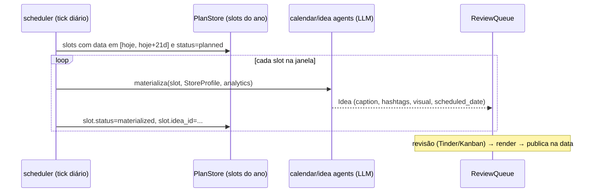
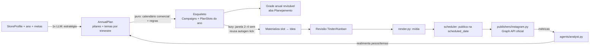

# Arquitetura: planejamento anual de conteúdo de uma empresa

> **Status:** proposta (arquitetura) · **Alvo:** Sprint 11–12 · Loja & Calendário editorial
> Amplia o escopo de [`calendario-posts-loja-instagram.md`](./calendario-posts-loja-instagram.md):
> de **um mês** para **o ano inteiro** de uma empresa. O calendário mensal passa a ser
> um **recorte** deste plano anual.

## 1. A ideia central (o que os artigos ensinam)

Planejar um ano **não é gerar ~300 posts prontos de uma vez**. Três razões, todas
apontadas pela literatura de calendário editorial:

- **Horizonte de materialização é curto.** O ideal é detalhar (legenda/criativo) numa
  janela de **2–4 semanas**: menos que isso vira reativo; mais que um mês, o conteúdo
  "envelhece" e se desconecta do que acontece na empresa
  ([Sprout Social](https://sproutsocial.com/insights/social-media-calendar/)).
- **Conteúdo é organizado por pilares + campanhas**, não post a post. Pilares são 2–4
  temas recorrentes (educativo, promocional, comunidade, inspiracional, bastidores,
  prova social) que **rotacionam a cada semana**; campanhas sazonais entram nas **datas
  comerciais** ([Postiz](https://postiz.com/blog/content-pillars-for-social-media),
  [SocialBee](https://socialbee.com/blog/social-media-content-calendar/)).
- **Custo e feedback.** Gerar 300 legendas/mídias em janeiro desperdiça tokens, estoura
  rate limits e ignora o que os **dados de desempenho** ensinariam ao longo do ano.

**Decisão de arquitetura (a mais importante):**

> **Planejar o *esqueleto* do ano de forma barata e determinística; materializar os
> *detalhes* de forma preguiçosa (lazy), numa janela rolante de 2–4 semanas,
> realimentada pelas métricas.**

Isso encaixa perfeitamente no que já existe: o `scheduler.py` já tem um *autogen tick*
que gera conteúdo por intervalo — nós o generalizamos para "materializar os próximos N dias
do plano".

## 2. Hierarquia de planejamento (5 níveis)

Um ano de conteúdo é uma árvore de cima para baixo:



| Nível | Entidade | Quando é gerado | Custo LLM |
|---|---|---|---|
| Ano | `AnnualPlan` | 1× no início (ou por trimestre) | 1 chamada (estratégia) |
| Trimestre | `QuarterTheme` | com o AnnualPlan; revisável a cada Q | baixo |
| Campanha | `Campaign` | com o esqueleto (datas comerciais) | baixo |
| Mês/Semana | `PlanSlot[]` | **esqueleto do ano todo, determinístico** | **zero por slot** |
| Post | `Idea` (estendida) | **lazy, janela rolante 2–4 sem.** | 1 chamada por post |

O **esqueleto** (150–300 slots/ano) é calculado por **matemática de calendário + regras**
— barato, estável, testável **sem Ollama**. O LLM só entra (a) 1× para a estratégia e (b)
por post, **só quando o slot entra na janela de materialização**.

## 3. Duas correntes que compõem o calendário

O calendário de qualquer mês é a **fusão** de duas fontes:

1. **Baseline / pilares (evergreen)** — preenche a cadência-base (ex.: 3×/semana),
   **rotacionando os pilares** por peso configurável. Pode ser **batelado e reciclado**
   (evergreen reaproveitável).
2. **Sazonal / campanhas** — ancorada no **calendário comercial** (ver §5). Insere/So­brepõe
   posts em datas específicas, com **arco narrativo** (teaser → esquenta → oferta →
   última chamada → prova social).

```
grade_do_mês = merge(
    rotação_de_pilares(cadência, pesos),     # baseline
    posts_de_campanha(datas_comerciais)       # sazonal, prioridade sobre baseline
)  # respeitando cadência e evitando sobrecarga de dias
```

## 4. Materialização lazy (janela rolante)

O esqueleto existe o ano todo, mas cada `PlanSlot` só vira `Idea` (com legenda/mídia)
quando entra na janela:



Vantagens: **custo controlado**, **conteúdo fresco**, e as **métricas** (via
`agents/analyst.py`) influenciam os slots ainda não materializados. Reusa o `autogen_tick`
existente — só troca "prompt fixo" por "próximos slots do plano".

## 5. Calendário comercial (`agents/commercial_calendar.py`, novo)

Núcleo **puro e testável** que, dado `(ano, região)`, devolve as datas comerciais/sazonais
do varejo brasileiro que ancoram campanhas:

| Trimestre | Datas-âncora (BR) |
|---|---|
| Q1 | Liquidações/volta às aulas (jan), Carnaval*, Dia do Consumidor (15/mar), Dia da Mulher (8/mar) |
| Q2 | Páscoa*, Dia das Mães* (2º dom. mai), Namorados (12/jun), Festas Juninas |
| Q3 | Férias (jul), Dia dos Pais* (2º dom. ago), Dia do Cliente (15/set), Primavera |
| Q4 | Dia das Crianças (12/out), **Black Friday*** (última sex. nov), Cyber Monday, Natal (25/dez), Ano Novo |

`*` = data **móvel** (calculada: Páscoa por Computus; Mães/Pais/Black Friday por regra de
"n-ésimo domingo/sexta"). Datas de **nicho** por empresa entram via `StoreProfile.keywords`.

## 6. Modelo de dados

Reaproveita `StoreProfile` e `Idea` do plano mensal; adiciona a camada de plano:

```python
@dataclass
class AnnualPlan:
    id: str
    company_id: str            # StoreProfile
    year: int
    goals: list[str]           # ["awareness", "vendas coleção X", ...]
    pillar_weights: dict       # {"educativo": 0.3, "promocional": 0.2, ...}
    cadence_per_week: int = 3
    status: str = "draft"      # draft | active | archived

@dataclass
class Campaign:
    id: str
    annual_plan_id: str
    name: str                  # "Black Friday 2026"
    anchor_date: str           # ISO
    window: tuple[str, str]    # (início, fim)
    phases: list[str]          # ["teaser","esquenta","oferta","última chamada","prova social"]
    goal: str
    pillar: str = "promocional"

@dataclass
class PlanSlot:               # a linha do esqueleto — barata, sem LLM
    id: str
    annual_plan_id: str
    date: str                  # ISO — o dia do post
    pillar: str
    post_format: str           # feed | carousel | reels | story
    campaign_id: str | None    # se faz parte de campanha
    phase: str | None          # fase do arco, se campanha
    status: str = "planned"    # planned | materialized | approved | scheduled | posted
    idea_id: str | None = None # aponta para a Idea quando materializado
```

- **Persistência:** novas tabelas na mesma base SQLite (`plans.py`, espelhando
  `board/store.py`). `Idea` continua na `ReviewQueue`.
- **`Idea` estendida** (campos opcionais já propostos no doc mensal): `store_id`,
  `scheduled_date`, `post_format`, `pillar`, `caption`, `hashtags`, `occasion`, + `slot_id`.
- **Estados** alinhados às boas práticas: `planned → materialized → approved → scheduled → posted`.

## 7. Pipeline anual (ponta a ponta)



## 8. Onde encaixa no que já existe

| Já existe | Papel no plano anual |
|---|---|
| `review/models.Idea` + `ReviewQueue` (SQLite) | post materializado; fila inalterada |
| `scheduler.py` (`run_autogen_tick`, `run_tick`) | **generalizar**: materializar janela rolante + publicar na data |
| `agents/llm` factory | estratégia (1×) e materialização (por post) |
| `agents/media` + `render.py` | mídia do post, inalterado |
| `agents/analyst.py` | fecha o loop: métricas → re-planejamento trimestral |
| `publishers/instagram.py` | publicação real (feed/carrossel/Reels) via Graph API |
| `board/store.py` | molde para `plans.py` (persistência do plano) |

## 9. Superfície de API (novos endpoints)

| Método | Rota | Descrição |
|---|---|---|
| `POST` | `/api/companies/{id}/annual-plan` | gera esqueleto do ano `{year, goals}` (barato, sem materializar) |
| `GET` | `/api/annual-plan/{id}` | plano + campanhas + slots (grade anual) |
| `PATCH` | `/api/plan-slots/{id}` | editar pilar/formato/data de um slot |
| `POST` | `/api/annual-plan/{id}/materialize` | materializa uma janela `{from, to}` → Ideas |
| `POST` | `/api/annual-plan/{id}/replan-quarter` | re-planeja um trimestre com métricas |

Geração do esqueleto e materialização em lote seguem o padrão **job assíncrono + polling**
(`jobs.py`).

## 10. Frontend — aba "Planejamento" (visão anual)

- **Timeline do ano**: 12 meses com campanhas destacadas nas datas comerciais.
- **Grade mensal** (drill-down): slots por dia com badge de pilar + ícone de formato +
  status (`planned/materialized/...`).
- **Editor de estratégia**: metas, pesos de pilares, cadência.
- Reusa o design system da Sprint 10 (tema, a11y, toasts, skeletons).

## 11. Escopo e conformidade (obrigatório — `CLAUDE.md`)

- **Somente APIs oficiais** (Meta Graph API, fluxo em 2 passos). Rate limit ~100 posts/24h
  por conta — irrelevante para o volume de uma empresa, mas o materializador/scheduler
  respeita o teto.
- **Sem evasão de detecção** (fingerprint/proxies/DM em massa).
- **Segredos só no `.env`** (`IG_USER_ID`, `IG_ACCESS_TOKEN`).
- **URL pública do criativo** para a Graph API continua sendo a dependência técnica a
  resolver (hospedagem) — bloqueia publicação real, não o planejamento.

## 12. Por que esta arquitetura (tradeoffs)

- **Esqueleto barato + materialização lazy** > gerar tudo antecipado: controla custo de LLM,
  evita conteúdo "stale", respeita rate limit e deixa as métricas influenciarem o que ainda
  não foi materializado. É o padrão de "rolling horizon" da literatura.
- **Determinístico onde dá** (datas, distribuição de slots) → testável sem Ollama; LLM só na
  estratégia e na cópia por post.
- **Reúso total** da esteira (Idea/queue/render/scheduler/analyst/publisher); adiciona apenas
  a camada de plano por cima.
- **Alternativa considerada e descartada:** modelar cada post como entidade nova
  (`CalendarPost`) desde o esqueleto. Rejeitada por dobrar modelos; o `PlanSlot` (leve) +
  `Idea` (materializada) separa bem "planejado" de "produzido".

## 13. Cards adicionais (Sprint 12 · Planejamento anual)

Sobre os cards da Sprint 11 (plano mensal), acrescentar:

1. **`AnnualPlan` + `Campaign` + `PlanSlot` + persistência** (`plans.py`). `alta`, `backend`.
2. **Calendário comercial BR** (datas fixas + móveis, puro/testável). `alta`, `backend`, `conteúdo`.
3. **Gerador de esqueleto anual** (estratégia 1× LLM + distribuição determinística). `alta`, `backend`, `conteúdo`.
4. **Materializador lazy** (generaliza `autogen_tick` p/ janela rolante). `média`, `backend`.
5. **Endpoints do plano anual + materialização**. `média`, `backend`.
6. **Aba Planejamento (timeline anual + drill-down)**. `média`, `frontend`.
7. **Re-planejamento trimestral com métricas** (liga o `analyst`). `baixa`, `backend`, `integração`.
8. **Testes** (comercial calendar, esqueleto, materialização, endpoints). `alta`, `testes`.

## 14. Critério de aceite (da feature completa)

- [ ] Gerar o **esqueleto de um ano** para uma empresa (campanhas nas datas comerciais +
      slots de baseline), **sem** materializar tudo, em segundos.
- [ ] Materializar uma **janela de 2–4 semanas** → Ideas com legenda/hashtags/visual.
- [ ] Campanhas com **arco de fases** aparecem ancoradas nas datas certas.
- [ ] Scheduler publica (ou simula) respeitando `scheduled_date`.
- [ ] Métricas realimentam o re-planejamento do trimestre seguinte.
- [ ] Núcleos puros cobertos por testes; `pytest -q` verde; `cd web && npm run build` ok.
- [ ] Entrega documentada em `docs/entregas/planejamento-anual.md`.

## 15. Referências

- [Meta — Publish Content (Instagram Platform)](https://developers.facebook.com/docs/instagram-platform/content-publishing/)
- [Sprout Social — Social media calendar](https://sproutsocial.com/insights/social-media-calendar/)
- [SocialBee — Yearly content calendar](https://socialbee.com/blog/social-media-content-calendar/)
- [Postiz — Content pillars](https://postiz.com/blog/content-pillars-for-social-media)
- [Hootsuite — Social media calendar](https://blog.hootsuite.com/social-media-calendar/)
</content>
