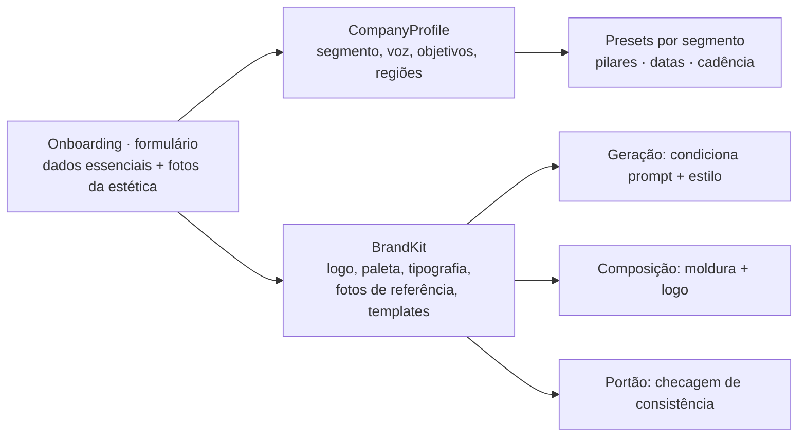
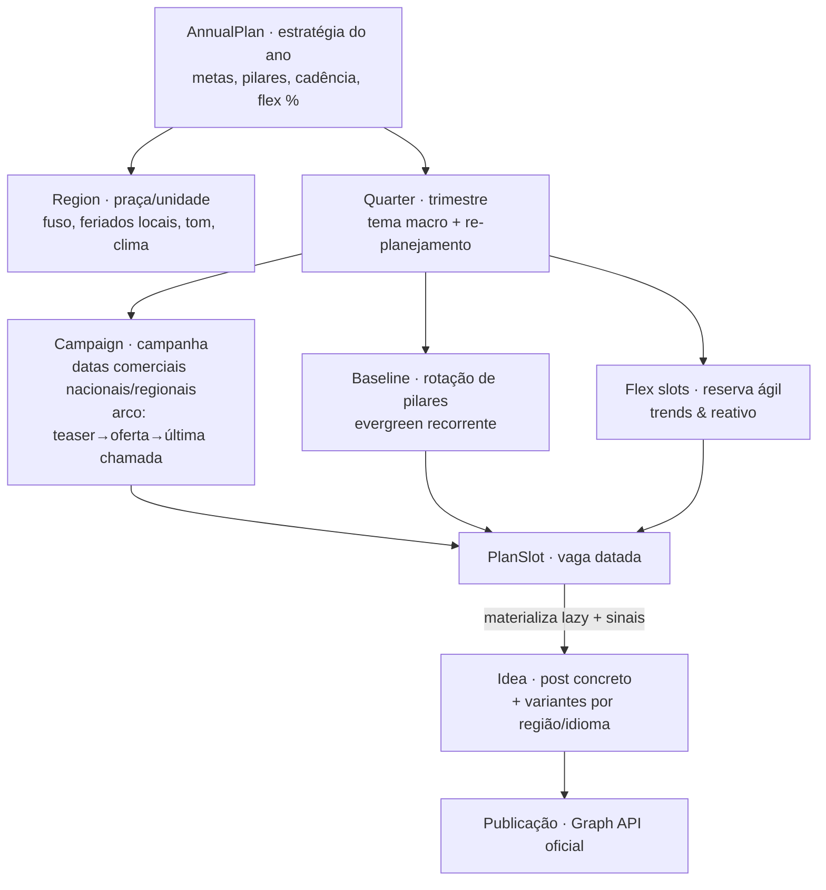
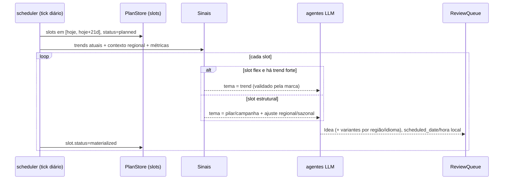
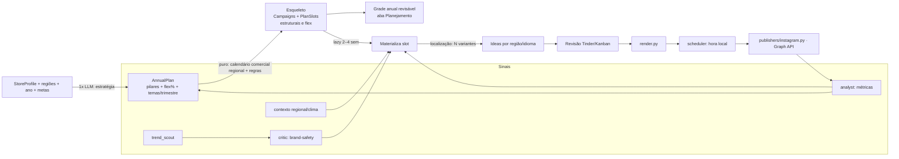

# Arquitetura: planejamento anual de conteúdo de uma empresa

> **Status:** proposta (arquitetura) · **Alvo:** Sprint 11–13 · Loja & Calendário editorial
> Amplia o escopo de [`calendario-posts-loja-instagram.md`](./calendario-posts-loja-instagram.md):
> de **um mês** para **o ano inteiro** de uma empresa **de qualquer segmento**, que entra por um
> **onboarding** (formulário + fotos da estética) e cujo **padrão de marca é mantido em todo
> post**. Inclui **regionalização**, **trends** e outros sinais dinâmicos. O calendário mensal
> passa a ser um **recorte** deste plano.

## 1. A ideia central

Planejar um ano **não é gerar ~300 posts prontos de uma vez**, e também **não é um plano
estático**. São duas forças combinadas:

- **Estrutura (planejável com antecedência):** pilares de conteúdo + campanhas ancoradas
  nas datas comerciais. Estável, barata, determinística.
- **Sinais dinâmicos (só se sabem perto da hora):** *trends* atuais, contexto **regional**,
  clima/sazonalidade local e **métricas** de desempenho. Voláteis, entram tarde.

Da literatura de calendário editorial tiramos três princípios:

- **Horizonte de detalhamento é curto** — 2–4 semanas: menos vira reativo; mais "envelhece"
  ([Sprout Social](https://sproutsocial.com/insights/social-media-calendar/)).
- **Planeje ~70–80%, deixe ~20–30% de folga** para conteúdo reativo/ágil (trends, notícias,
  UGC). Um calendário 100% preenchido não consegue surfar uma trend.
- **Conteúdo é organizado por pilares + campanhas**, não post a post, e **realimentado por dados**
  ([Postiz](https://postiz.com/blog/content-pillars-for-social-media),
  [SocialBee](https://socialbee.com/blog/social-media-content-calendar/)).

**Decisão de arquitetura (a mais importante):**

> **Planejar o *esqueleto* do ano de forma barata e determinística; reservar *flex slots*
> para reação; e materializar os *detalhes* de forma preguiçosa (lazy) numa janela rolante,
> modulada por três sinais — regionalização, trends e métricas.**

Isso encaixa no que já existe: o `scheduler.py` já tem um *autogen tick*; nós o
generalizamos para "materializar os próximos slots do plano **aplicando os sinais atuais**".

## 1-bis. Ponto de entrada: qualquer empresa começa por um formulário + Brand Kit

A ferramenta é **agnóstica de segmento** — padaria, clínica, e-commerce, estúdio, SaaS: toda
empresa entra pelo mesmo **onboarding guiado**, um formulário que captura os **dados
essenciais** e a **estética** da marca. Desse intake nascem dois artefatos que **governam
tudo** depois:

- **`CompanyProfile`** — identidade, **segmento**, público, região(ões), objetivos, voz da
  marca (tom, *do's & don'ts*), links.
- **`BrandKit`** — o "manual de marca": logo, **paleta (hex)**, tipografia, palavras-chave de
  estilo, **fotos de referência da estética** (uploads) e **templates/molduras** por formato.

O **segmento** escolhido no formulário define **presets** (mix de pilares, datas comerciais
relevantes, cadência sugerida) — é assim que a mesma ferramenta serve qualquer tipo de negócio.



### Como o padrão é mantido em TODO post

Consistência de marca é **imposta**, em três pontos da linha de montagem — não fica a cargo do
acaso do modelo:

1. **Condicionamento na geração** — o `visual_prompt` de cada post recebe automaticamente
   **paleta + palavras-chave de estilo**, e o provider de imagem usa as **fotos de referência
   como referência de estilo** (img2img / IP-Adapter no **ComfyUI**, que já é um provider). É
   aqui que as "fotos da estética" entram de fato.
2. **Template na composição** — `render.py` aplica a **moldura da marca** (logo, cores,
   tipografia, áreas seguras) por formato: todo post sai com o mesmo esqueleto visual.
3. **Portão de consistência** — o **Guardião da Marca** (`critic.py`, estendido para o visual)
   confere aderência à paleta/tom **antes** de aprovar; fora do padrão, volta para ajuste.

> N posts, a mesma cara. O `BrandKit` é o **contrato visual** que a agência inteira obedece —
> e o `CompanyProfile` é o briefing que a estratégia segue.

## 2. Hierarquia de planejamento (com região)



O **esqueleto** (150–300 slots/ano, incluindo os *flex* vazios) é calculado por
**matemática de calendário + regras** — barato, testável **sem Ollama**. O LLM só entra
(a) 1× na estratégia e (b) por post, **no momento da materialização**, quando os sinais
dinâmicos já são conhecidos.

## 3. Materialização lazy modulada por sinais

Cada `PlanSlot` só vira `Idea` (com legenda/mídia) ao entrar na janela — e nesse instante
recebe os **três sinais**:



Os *flex slots* têm janela **ainda mais curta** (dias), porque trend decai rápido — o que
reforça o desenho lazy.

## 4. Regionalização

Uma empresa com várias praças/unidades não posta o mesmo conteúdo igual em todo lugar.
Dimensões que a arquitetura trata:

| Dimensão regional | Efeito no conteúdo |
|---|---|
| **Feriados/datas locais** | Estaduais e municipais + festas culturais (São João no NE, Farroupilha/RS, Círio de Nazaré/PA, Carnaval por intensidade regional) entram como campanhas **só naquela região**. |
| **Fuso horário** | BR tem múltiplos fusos (−2 a −5). `scheduled_date` guarda **hora local** por região; o publisher converte. |
| **Linguagem/tom** | Regionalismos e gírias; ajuste de tom por praça (mantendo a marca). |
| **Clima/estação** | Mesmo mês, mensagens opostas (frio no Sul × calor no NE). |
| **Idioma** | Reusa `agents/translator.py` (PT/EN/ES) para praças/canais distintos. |

**Modelo:** um `PlanSlot` é **agnóstico de região**; na materialização ele **se ramifica**
em N `Idea` (uma por região ativa) via um passo de **localização** (LLM adapta tom, datas e
clima; tradução quando aplicável). O calendário comercial vira **região-consciente** (§5).

## 5. Calendário comercial região-consciente (`agents/commercial_calendar.py`, novo)

Núcleo **puro e testável**: dado `(ano, região)` devolve as datas-âncora, **empilhando**
três camadas:

1. **Nacional** — Consumidor (15/mar), Mães*, Namorados (12/jun), Pais*, Cliente (15/set),
   Crianças (12/out), **Black Friday*** (última sex./nov), Natal, Ano Novo…
2. **Regional/estadual** — feriados estaduais + festas culturais da praça.
3. **Nicho da empresa** — datas próprias (aniversário da loja, lançamentos) via `StoreProfile`.

`*` = data **móvel** (Páscoa por Computus; Mães/Pais/Black Friday por regra de "n-ésimo
dia da semana"). Camadas 1–2 são tabelas curadas; 3 vem do perfil.

## 6. Trends atuais (sinal dinâmico + governança)

Trends não cabem no esqueleto (mudam toda semana). A arquitetura as trata como um **sinal**
que preenche os *flex slots* e tempera a materialização.

**`agents/trend_scout.py` (novo)** — coleta e ranqueia trends, **apenas de fontes
permitidas** (conformidade, §9):

- **APIs oficiais / feeds permitidos** (onde existirem) de temas/hashtags/áudios em alta.
- **Sinal interno** — os próprios top-performers da conta via `agents/analyst.py` (o que já
  funciona para *esta* marca é a melhor "trend").
- **Curadoria manual** — o operador injeta uma trend pelo painel (fonte confiável, sem
  scraping que burle detecção).

O que o `trend_scout` produz é um `TrendSignal {tema, tipo (áudio/hashtag/formato/assunto),
score, validade, fonte}`. O **agente crítico** (`agents/critic.py`, já existe) funciona como
**gate de brand-safety**: rejeita trends que destoam da marca ou são arriscadas **antes** de
virar post. O LLM então **adapta** um pilar evergreen ao formato/tema da trend — sem forçar a
marca a algo fora de tom.

> Regra de ouro: **trend a serviço da marca**, com validade curta e passando pelo gate. Nunca
> publicar automaticamente uma trend sem o gate de marca.

## 7. Modelo de dados

O intake (§1-bis) gera `CompanyProfile` + `BrandKit`; sobre eles vem a camada de plano +
região + trend. `Idea` continua sendo o post materializado.

```python
@dataclass
class CompanyProfile:             # generaliza o "StoreProfile" — qualquer segmento
    id: str; name: str
    segment: str                  # varejo | serviço | food | saúde | SaaS | ...
    description: str; audience: str
    goals: list[str]
    tone: str; dos: list[str]; donts: list[str]
    keywords: list[str]; links: dict
    region_ids: list[str] = ...   # praças ativas

@dataclass
class BrandKit:                   # "manual de marca" — governa a estética de todo post
    company_id: str
    logo_path: str | None = None
    palette: list[str] = ...      # cores hex
    fonts: dict = ...             # {display, body}
    style_keywords: list[str] = ...   # descritores estéticos injetados no prompt
    reference_images: list[str] = ... # "fotos da estética" (uploads)
    templates: dict = ...         # molduras por formato {feed, carousel, reels, story}

@dataclass
class AnnualPlan:
    id: str; company_id: str; year: int
    goals: list[str]
    pillar_weights: dict          # {"educativo": .3, "promocional": .2, ...}
    cadence_per_week: int = 3
    flex_ratio: float = 0.25      # % de slots reservados p/ trends/reativo
    status: str = "draft"         # draft | active | archived

@dataclass
class Region:
    id: str; company_id: str
    name: str                     # "Nordeste", "Loja Centro POA"
    timezone: str = "America/Sao_Paulo"
    locale_tone: str = ""         # regionalismos/tom
    extra_dates: list[str] = ...  # feriados/festas locais
    language: str = "pt-BR"

@dataclass
class Campaign:
    id: str; annual_plan_id: str
    name: str; anchor_date: str; window: tuple[str, str]
    phases: list[str]             # teaser, esquenta, oferta, última chamada, prova social
    goal: str; pillar: str = "promocional"
    region_id: str | None = None  # None = nacional

@dataclass
class PlanSlot:                   # esqueleto — barato, sem LLM, agnóstico de região
    id: str; annual_plan_id: str
    date: str; pillar: str; post_format: str
    kind: str = "structural"      # structural | flex
    campaign_id: str | None = None; phase: str | None = None
    status: str = "planned"       # planned | materialized | approved | scheduled | posted

@dataclass
class TrendSignal:
    id: str; theme: str
    kind: str                     # audio | hashtag | format | topic
    score: float; valid_until: str; source: str
    approved: bool = False        # passou pelo gate de marca (critic)
```

- `Idea` estendida (campos opcionais): `store_id`, `region_id`, `slot_id`, `scheduled_date`
  (com hora local), `post_format`, `pillar`, `caption`, `hashtags`, `occasion`, `trend_id`.
- Um `PlanSlot` → **N `Idea`** (uma por `Region` ativa) na localização.
- Persistência: novas tabelas na base SQLite (`plans.py`, espelhando `board/store.py`).

## 8. Pipeline anual (ponta a ponta)



## 9. Escopo e conformidade (obrigatório — `CLAUDE.md`)

- **Somente APIs oficiais** (Meta Graph API, 2 passos). Rate limit ~100 posts/24h por conta;
  o materializador respeita o teto mesmo com múltiplas regiões/variantes.
- **Trends só de fontes permitidas:** APIs oficiais, sinal interno (analyst) e curadoria
  manual. **Sem scraping que burle detecção**, sem fingerprint/proxies/DM em massa.
- **Gate de marca obrigatório** antes de publicar qualquer post baseado em trend.
- **Segredos só no `.env`** (`IG_USER_ID`, `IG_ACCESS_TOKEN`).
- **URL pública do criativo** para a Graph API segue como dependência técnica (hospedagem).

## 10. Outros pontos que a arquitetura já acomoda

- **Timing por fuso/região** — melhor horário por praça; `scheduled_date` em hora local.
- **Reciclagem de evergreen** — posts de bom desempenho voltam re-skinnados (baixo custo).
- **A/B de título/thumbnail** — já entregue; aplica-se por variante regional.
- **Governança de marca** — `StoreProfile` guarda tom e *do's/don'ts*; o critic zela.
- **Acessibilidade** — alt text + legendas queimadas (já existe burn-in) por variante.
- **Multi-idioma** — `agents/translator.py` cobre PT/EN/ES na localização.

## 11. Superfície de API (novos endpoints)

| Método | Rota | Descrição |
|---|---|---|
| `POST` | `/api/companies/{id}/regions` | cadastra praça/região (fuso, feriados, tom) |
| `POST` | `/api/companies/{id}/annual-plan` | gera esqueleto do ano (barato, sem materializar) |
| `GET` | `/api/annual-plan/{id}` | plano + campanhas + slots (grade anual) |
| `POST` | `/api/annual-plan/{id}/materialize` | materializa janela `{from,to}` aplicando sinais |
| `GET`/`POST` | `/api/trends` | lista trends ranqueadas / injeta trend manual (→ gate) |
| `POST` | `/api/annual-plan/{id}/replan-quarter` | re-planeja trimestre com métricas |

## 12. Onde encaixa no que já existe

| Já existe | Papel |
|---|---|
| `review/models.Idea` + `ReviewQueue` | post materializado (agora com variantes por região) |
| `scheduler.py` (`autogen_tick`/`run_tick`) | **generalizar**: materializar janela + aplicar sinais + publicar na hora local |
| `agents/analyst.py` | sinal interno de trend + re-planejamento trimestral |
| `agents/critic.py` | gate de brand-safety das trends |
| `agents/translator.py` | localização multi-idioma |
| `agents/llm` factory | estratégia (1×) + materialização/localização |
| `agents/media` + `render.py` | mídia por variante |
| `publishers/instagram.py` | publicação oficial, hora local por região |
| `board/store.py` | molde para `plans.py` |

## 12-bis. O time de marketing completo (agência virtual)

Requisito: **todo post segue o processo de uma equipe de marketing completa** — da
estratégia à análise. A arquitetura modela isso como uma **agência virtual**: cada função
é um **agente com contrato**, e o post é uma ordem de serviço que percorre a linha de
montagem com **portões de qualidade**. A maior parte do time **já existe** no repo.

**Organograma → agentes (17 papéis, 5 departamentos):**

| Departamento | Papel | Agente | Estado |
|---|---|---|---|
| Estratégia & Planejamento | Head de Estratégia | `niche_creator.py` | instalado |
| | Radar de Tendências | `trend_scout.py` | **novo** |
| | Planejador de Conteúdo | `calendar_planner.py` | **novo** |
| | Product Owner (backlog/aprovação) | `board/` + revisão | instalado |
| Criação · Estúdio | Redator / Copy | `idea_generator.py` | instalado |
| | Roteirista | `script_writer.py` | instalado |
| | Títulos A/B | `titler.py` | instalado |
| | Diretor de Arte | `agents/media` (imagem) | instalado |
| | Editor de Vídeo | `render.py` · `video_pipeline.py` | instalado |
| | Locução / Voz | `agents/media` (voz) | instalado |
| | Localização | `translator.py` | instalado |
| Qualidade & Marca | Editor-chefe (loop) | `editor.py` | instalado |
| | Guardião da Marca / Brand-safety | `critic.py` | instalado |
| | Aprovação humana | `review/` + web | instalado |
| Distribuição · Mídia | Social Media Manager / Agendamento | `scheduler.py` | instalado |
| | Publicação | `publishers/instagram.py` | em obra (scaffold) |
| Dados & Growth | Analista de Performance | `analyst.py` | instalado |

**Linha de montagem (todo post):** `01 Brief` → `02 Estratégia & ângulo` *(gate de trend)*
→ `03 Redação` → `04 Produção` → `05 Localização` → `06 Revisão` **[portão: editor →
critic → humano]** → `07 Agendamento` → `08 Publicação` **[só API oficial]** → `09 Análise`
→ **realimenta 01**.

Todo o time trabalha **sob o `BrandKit`** gerado no onboarding (§1-bis): o Diretor de Arte
condiciona a geração pela estética, o Editor aplica a moldura, e o Guardião da Marca reprova o
que fugir do padrão — é o que garante que **N posts tenham a mesma cara**.

Isso segue o padrão do repo (contrato + factory por capacidade): cada papel é plugável e
os handoffs são estados da `Idea`/`PlanSlot`. Apresentação visual do time:
**[Agência Virtual](https://claude.ai/code/artifact/b4480a28-0ccb-4450-ba3b-696e9aa739fe)**.

## 13. Cards adicionais

**Sprint 11 · Onboarding & Marca (fundação)**
0a. Onboarding guiado (formulário multi-etapas + **upload de fotos da estética**). `alta`, frontend, backend.
0b. `CompanyProfile` + `BrandKit` + storage de imagens de referência. `alta`, backend.
0c. Presets por segmento (pilares/datas/cadência por tipo de negócio). `alta`, backend, conteúdo.
0d. Condicionamento de estilo na geração (fotos de referência via ComfyUI/img2img). `alta`, backend, conteúdo.
0e. Template/moldura de marca no `render.py` (logo, paleta, tipografia, safe areas). `média`, backend.
0f. Portão de consistência visual (estende `critic.py` para paleta/tom). `média`, backend.

**Sprint 12 · Planejamento anual**
1. `AnnualPlan`/`Campaign`/`PlanSlot` + persistência (`plans.py`). `alta`, backend.
2. Calendário comercial região-consciente (nacional+regional+nicho; datas móveis). `alta`, backend, conteúdo.
3. Gerador de esqueleto anual (estratégia 1×LLM + distribuição + flex slots). `alta`, backend, conteúdo.
4. Materializador lazy (generaliza `autogen_tick`, janela rolante). `média`, backend.
5. Endpoints do plano anual + materialização. `média`, backend.
6. Aba Planejamento (timeline anual + drill-down). `média`, frontend.

**Sprint 13 · Regionalização & Trends**
7. Modelo `Region` + localização (fan-out de variantes, fuso/tom/clima). `alta`, backend, conteúdo.
8. `agents/trend_scout.py` + `TrendSignal` (fontes permitidas + sinal interno). `alta`, backend, integração.
9. Gate de brand-safety de trends (liga o `critic`) + injeção manual pela UI. `média`, backend, frontend.
10. Re-planejamento trimestral com métricas (liga o `analyst`). `baixa`, backend.
11. Testes (calendário regional, esqueleto+flex, localização, trend gate, endpoints). `alta`, testes.

## 14. Critério de aceite (feature completa)

- [ ] Uma empresa **de qualquer segmento** é cadastrada por um **formulário** (dados essenciais
      + fotos da estética) e gera `CompanyProfile` + `BrandKit`.
- [ ] **Todo post** gerado adere ao Brand Kit (paleta/estilo/moldura) e passa pelo **portão de
      consistência** antes de aprovar.
- [ ] Gerar o **esqueleto de um ano** (campanhas nas datas comerciais nacionais **e regionais**,
      slots estruturais + **flex**) em segundos, sem materializar tudo.
- [ ] Materializar uma **janela 2–4 semanas** → Ideas, com **variantes por região** (tom/fuso/clima).
- [ ] *Flex slots* absorvem uma **trend** (via `trend_scout`/manual) **só após o gate de marca**.
- [ ] Scheduler publica (ou simula) na **hora local** de cada região respeitando `scheduled_date`.
- [ ] Métricas realimentam pesos de pilar e o re-planejamento do trimestre seguinte.
- [ ] Núcleos puros (calendário, distribuição, localização) cobertos por testes;
      `pytest -q` verde; `cd web && npm run build` ok.
- [ ] Entrega documentada em `docs/entregas/planejamento-anual.md`.

## 15. Referências

> Lista completa, com a contribuição de cada fonte e ressalvas de acesso:
> [`referencias-artigos.md`](./referencias-artigos.md).

- [Meta — Publish Content (Instagram Platform)](https://developers.facebook.com/docs/instagram-platform/content-publishing/)
- [Sprout Social — Social media calendar](https://sproutsocial.com/insights/social-media-calendar/)
- [SocialBee — Yearly content calendar](https://socialbee.com/blog/social-media-content-calendar/)
- [Postiz — Content pillars](https://postiz.com/blog/content-pillars-for-social-media)
- [Hootsuite — Social media calendar](https://blog.hootsuite.com/social-media-calendar/)
</content>
